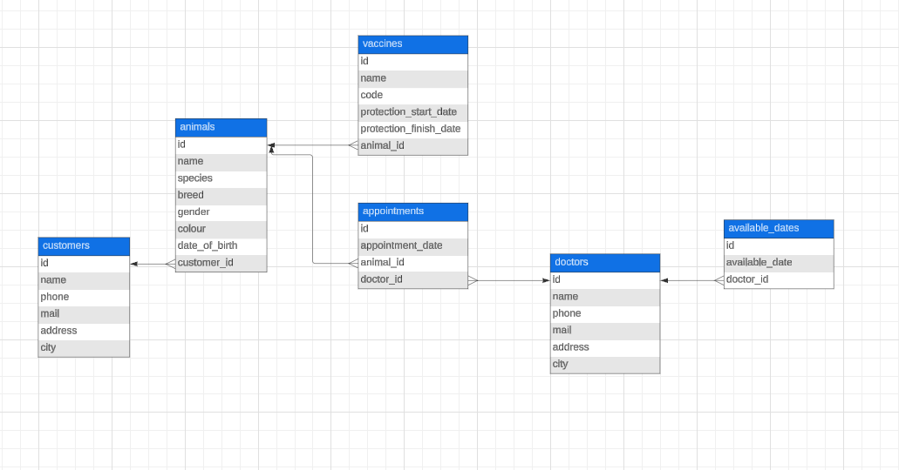

# Veterinary Management System

## Overview

The Veterinary Management System is designed to help veterinary clinics manage their operations, including registering veterinary doctors, recording doctors' working days, registering customers and their animals, recording vaccines, and scheduling appointments. This system ensures efficient management of veterinary operations and prevents scheduling conflicts.

## Features

- Register veterinary doctors
- Record doctors' available days
- Register customers
- Register animals belonging to customers
- Record vaccines administered to animals
- Schedule appointments for animals with veterinary doctors

## Technologies Used

- Java
- Spring Boot
- Spring Data JPA
- PostgreSQL

## Project Structure

The project follows a layered architecture with the following layers:
- Controller
- Service
- Repository
- Model

## Entities

- **Animal**: Represents the animal under veterinary care.
- **Customer**: Represents the owner of the animal.
- **Doctor**: Represents the veterinary doctor.
- **AvailableDate**: Represents the dates a doctor is available.
- **Appointment**: Represents the appointments scheduled for animals with doctors.
- **Vaccine**: Represents the vaccines administered to animals.

## Setup

### Prerequisites

- Java 11 or higher
- Maven
- PostgreSQL

### Database Configuration

Configure the database connection in `application.properties`:

```properties
spring.datasource.url=jdbc:postgresql://localhost:5432/veterinary_management_system
spring.datasource.username=postgres
spring.datasource.password=440616
spring.jpa.hibernate.ddl-auto=update
```

### Running the Application

1. Clone the repository
2. Navigate to the project directory
3. Run `mvn clean install`
4. Start the application using `mvn spring-boot:run`

## API Documentation

### Animal Endpoints

| Endpoint                           | Method | Description                    |
|------------------------------------|--------|--------------------------------|
| /api/animals                       | GET    | Get all animals                |
| /api/animals                       | POST   | Create a new animal            |
| /api/animals/{id}                  | GET    | Get an animal by ID            |
| /api/animals/{id}                  | PUT    | Update an animal by ID         |
| /api/animals/{id}                  | DELETE | Delete an animal by ID         |
| /api/animals/search?name={name}    | GET    | Get animal by name             |

### Appointment Endpoints

| Endpoint                           | Method | Description                                |
|------------------------------------|--------|--------------------------------------------|
| /api/appointments                  | GET    | Get all appointments                       |
| /api/appointments                  | POST   | Create a new appointment                   |
| /api/appointments/{id}             | GET    | Get an appointment by ID                   |
| /api/appointments/{id}             | PUT    | Update an appointment by ID                |
| /api/appointments/{id}             | DELETE | Delete an appointment by ID                |
| /api/appointments/doctor           | POST   | Get appointments by date range and doctor  |
| /api/appointments/animal           | POST   | Get appointments by date range and animal  |

### AvailableDate Endpoints

| Endpoint                           | Method | Description                    |
|------------------------------------|--------|--------------------------------|
| /api/available-dates               | GET    | Get all available dates        |
| /api/available-dates               | POST   | Create a new available date    |
| /api/available-dates/{id}          | GET    | Get an available date by ID    |
| /api/available-dates/{id}          | PUT    | Update an available date by ID |
| /api/available-dates/{id}          | DELETE | Delete an available date by ID |

### Customer Endpoints

| Endpoint                           | Method | Description                    |
|------------------------------------|--------|--------------------------------|
| /api/customers                     | GET    | Get all customers              |
| /api/customers                     | POST   | Create a new customer          |
| /api/customers/{id}                | GET    | Get a customer by ID           |
| /api/customers/{id}                | PUT    | Update a customer by ID        |
| /api/customers/{id}                | DELETE | Delete a customer by ID        |
| /api/customers/search?name={name}  | GET    | Get customer by name           |

### Doctor Endpoints

| Endpoint                           | Method | Description                    |
|------------------------------------|--------|--------------------------------|
| /api/doctors                       | GET    | Get all doctors                |
| /api/doctors                       | POST   | Create a new doctor            |
| /api/doctors/{id}                  | GET    | Get a doctor by ID             |
| /api/doctors/{id}                  | PUT    | Update a doctor by ID          |
| /api/doctors/{id}                  | DELETE | Delete a doctor by ID          |

### Vaccine Endpoints

| Endpoint                           | Method | Description                               |
|------------------------------------|--------|-------------------------------------------|
| /api/vaccines                      | GET    | Get all vaccines                          |
| /api/vaccines                      | POST   | Create a new vaccine                      |
| /api/vaccines/{id}                 | GET    | Get a vaccine by ID                       |
| /api/vaccines/{id}                 | PUT    | Update a vaccine by ID                    |
| /api/vaccines/{id}                 | DELETE | Delete a vaccine by ID                    |
| /api/vaccines/animal/{animalId}    | GET    | Get vaccines by animal ID                 |
| /api/vaccines/protection-finish    | GET    | Get vaccines by protection finish date    |

## UML Diagram
